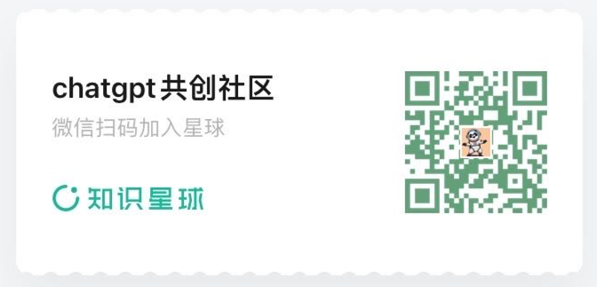

## ChatGPT Blog Generator

> ChatGPT Blog Generator 服务主要为以下功能提供支持和实现

* 通过 `vuePress`网站来展示博客内容
* 与ChatGPT交互，使其每天产生 `100`个跟ChatGPT变现相关的 `TOPIC`话题
* 与ChatGPT交互，使其根据每个 `TOPIC` 创造出对应的 `Blog` 博客

### 目标

* 通过这个项目记录我通过ChatGPT自动完成博客网站构建，并实现分发的整个Prompt研究过程
* 使用ChatGPT帮助实现MyWriter服务
* 使用ChatGPT帮助实现 `Blog` 网站

### 过程记录

[prompt_records](./docs/1%20-%20使用ChatGPT生成100个话题/Prompt-使用ChatGPT生成100话题.md)

### 结果

### 加入星球学习更多、相互交流、谈合作

* ChatGPT帮我实现React前端项目
* ChatGPT帮我实现Python项目
* ChatGPT帮我实现Java后端项目
* [高阶] ChatGPT帮我实现Visual Studio Code插件
* [高阶] ChatGPT帮我实现Python爬虫
* [高阶] ChatGPT帮我实现自动发微信公众号
* [高阶] ChatGPT帮我实现自动发星球动态
* [高阶] ChatGPT帮我爬油管、创造短视频
* [高阶] ChatGPT帮我发送抖音和Tiktok
* 更多课程等你来参与~

### 微信加好友了解细节

